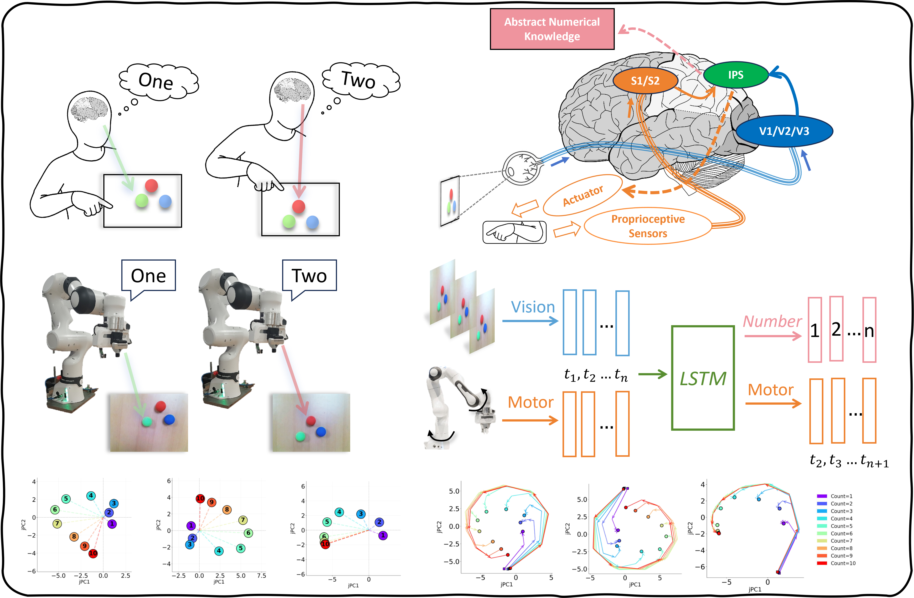

# ETALK Counting

Official code repository for the paper:

## Minimal Embodiment Enables Efficient Learning of Number Concepts in Robo




## Overview

This project studies how minimal embodied signals help robots learn number concepts efficiently.
The repository contains three complementary model settings for controlled comparison:

- Embodied counting (visual + joint-state inputs)
- Single-image counting baseline
- Sequence-pooling baseline

## Repository Scope

This codebase provides:

- Model definitions and training pipelines
- Data loading utilities for each experimental setting
- Analysis scripts for representation and behavior-level evaluation
- Result extraction scripts for cross-experiment comparison

## Code Organization

- [Models](Models): neural network architectures
- [Data_loader](Data_loader): dataset and dataloader utilities
- [trainer.py](trainer.py), [trainer_single_image.py](trainer_single_image.py), [trainer_sequence_pooling.py](trainer_sequence_pooling.py): training logic
- [main.py](main.py), [main_single_image.py](main_single_image.py), [main_sequence_pooling.py](main_sequence_pooling.py): experiment entry points
- [analyze_embodied_v2.py](analyze_embodied_v2.py), [analyze_single_image.py](analyze_single_image.py): analysis and visualization
- [extract_all_results.py](extract_all_results.py): experiment summary aggregation

## Notes

- This repository is the research code used for the paper experiments.
- Paths and cluster-specific defaults may need adaptation for different environments.
- Non-English comments and strings were removed during open-source cleanup.

## Citation

If you use this code in academic work, please cite the paper:

```bibtex
@article{minimal_embodiment_number_concepts_robo,
  title={Minimal Embodiment Enables Efficient Learning of Number Concepts in Robo},
  author={Anonymous},
  journal={TBD},
  year={2026}
}
```
